# mods-claude

[](https://mesix971.github.io/mods-claude/)

**▶ [Voir le film de présentation](https://mesix971.github.io/mods-claude/)**

Deux mods pour [Claude Code](https://claude.com/claude-code) :

- **clawd** : le petit Claude orange en pixel art qui vit au-dessus de ton
  prompt et réagit, sans un mot, à ce qui se passe dans ta session.
- **atelier** : un bandeau projet (versions APK ↔ téléphone, git, jauges de
  quotas) et des garde-fous pour le dev Android.

Projet perso, fan-made et non officiel, sans lien avec Anthropic.

## Installation

```bash
claude plugin marketplace add mesix971/mods-claude
claude plugin install clawd@mods-claude
claude plugin install atelier@mods-claude
```

Ouvre ensuite une nouvelle session : Clawd te fait coucou. Tu ne veux que
Clawd ? N'installe que lui. Il te faut une version récente de Claude Code,
car les mods utilisent les hooks de fonction.

Pour les mettre à jour :

```bash
claude plugin update clawd@mods-claude
```

<details>
<summary>Sans la marketplace (pour développer les mods)</summary>

Clone le dépôt, puis indique les dossiers des mods dans le bloc `env` de
`~/.claude/settings.json` :

```json
{
  "env": {
    "CLAUDE_CODE_PLUGIN_DIRS": "/chemin/vers/mods-claude/clawd:/chemin/vers/mods-claude/atelier"
  }
}
```

Sous Windows, sépare les chemins par `;` au lieu de `:` et double les
antislashs (`C:\\chemin\\vers\\…`).

</details>

## clawd

Le petit Claude orange, en pixel art animé, à droite du bandeau au-dessus du
prompt. Fond transparent, taille du Clawd de l'app, contour et ombre qui
suivent ton thème clair ou sombre. Pas un mot : tout passe par ses gestes.

- **Au repos**, il se balade sur sa petite scène : il marche, regarde autour,
  saute, s'assoit en balançant les pattes, fait coucou, puis revient. Entre
  deux balades, il s'occupe : café, jonglage, pêche, guitare, corde à sauter,
  lecture, papillon, arrosage, yoyo, ballon, bulles, pirouette, méditation,
  cookie… Il s'endort après 10 min sans rien.
- **Au travail**, il déménage trois cartons d'une pile à l'autre, un par un,
  puis les rapporte, en boucle. Une bulle au-dessus de sa tête montre ce que
  fait Claude (loupe quand il cherche, crayon quand il écrit…) sans
  l'interrompre.
- **Il réagit à la session.** Il saute quand tu envoies un message. Pendant
  un build, il tape au marteau ; pendant les tests, il coche une liste. Pour
  un push, il lance un avion en papier ; pour une install, il tient le tel.
  Quand la conversation se compacte, il saute sur la pile de feuilles pour
  la tasser (elle rebondit…), puis te montre le petit paquet ficelé. Quand
  Claude attend ta permission, il lève la patte et tape du pied ; quand il te
  pose une question, il brandit une pancarte « ? » ; quand des dépendances
  s'installent, il déballe un carton.
- **Sa couleur suit le modèle** : Haiku en vert pistache, Sonnet en abricot
  pâle, Opus dans le terracotta d'origine, Fable en corail vif.
- **Les sous-agents** arrivent chacun en mini-Clawd, qui mime ce que fait son
  agent (carton, loupe, écriture, marteau). Clawd dirige le chantier,
  planchette en main, et leur fait coucou quand ils repartent.
- **Ses humeurs.** Confettis si ça passe, petit nuage de pluie si ça casse.
  Il tremble devant un garde-fou et a le vertige quand le contexte est plein.
  Après 1 h du matin, il te propose d'aller dormir.
- **Survole-le** : ♥ pour le caresser (le compteur est gardé entre les
  sessions) et 🎲 pour qu'il change d'activité.

## atelier

**Le bandeau au-dessus du prompt**

- 📱 Version déclarée, dernier APK construit et version installée sur le
  téléphone (date comprise). Boutons **Installer sur le tel** (`i`) et
  **Lancer** (`l`).
- 🌿 Branche, nombre de modifs, commits non poussés, alerte si la version est
  bumpée sans CHANGELOG. Bouton **Commit + push** (`c`).
- Jauges des quotas 5 h et 7 j et du contexte, à lire d'un coup d'œil :
  - **couleur** : vert, ambre ou rouge selon le niveau, et la barre pulse en
    critique ;
  - **petit trait** : il marque le temps écoulé dans la fenêtre. Si la barre
    le dépasse, tu consommes trop vite et la jauge vire à l'ambre avant même
    le seuil ;
  - **heure du reset** : elle s'affiche quand ça devient serré.

  Un toast t'avertit aussi à 80 % puis à 95 %.

**Les garde-fous sur Bash et PowerShell**

- adb et le JBR d'Android Studio sont trouvés tout seuls (Windows, macOS,
  Linux). Si une commande pointe vers un JBR d'Android Studio cassé, il est
  remplacé par celui qui marche. `JAVA_HOME` est ajouté à `gradlew` quand il
  manque.
- Commandes destructrices (`pm clear`, `uninstall`, `connectedAndroidTest`,
  push forcé, `reset --hard`…) : il faut ton accord.
- Secrets (`local.properties`, keystore, `google-services.json`, `.env`) en
  partance dans un commit ou un push : demande de confirmation.
- Commit ou push non demandé : demande de confirmation.
- Refusés : `bash` lancé depuis PowerShell (sous Windows, ça ouvre WSL) et les
  `Start-Sleep` de 20 s ou plus (mieux vaut une tâche de fond).

**Divers**

- Si Claude répond en anglais, il reçoit un rappel au tour suivant.
- `/tel` installe le dernier APK ; `/atelier` masque ou affiche le bandeau et
  donne la version.

## Développer

```bash
claude plugin validate clawd
claude plugin test clawd
```

Le film de présentation (`docs/index.html`, publié sur GitHub Pages) et la
bande-annonce du README (`promo/bande-annonce.svg`) sont générés depuis le
code des mods, avec leurs vrais sprites et leurs vraies jauges :

```bash
node --experimental-strip-types promo/genere.mts
```
